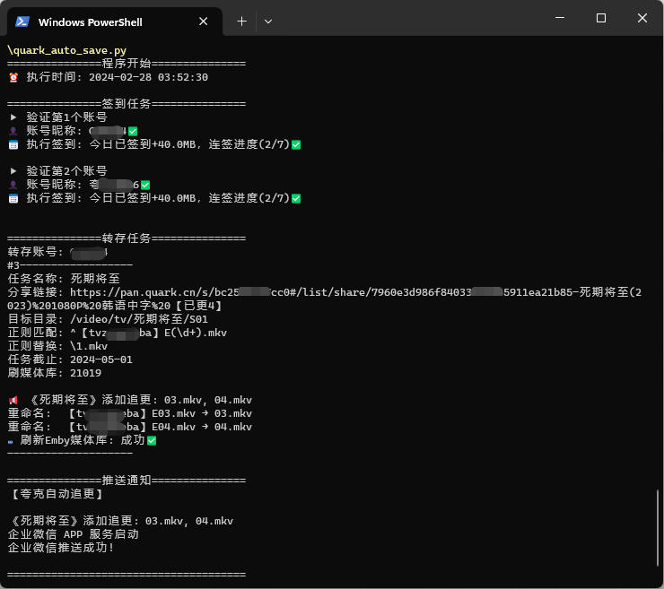
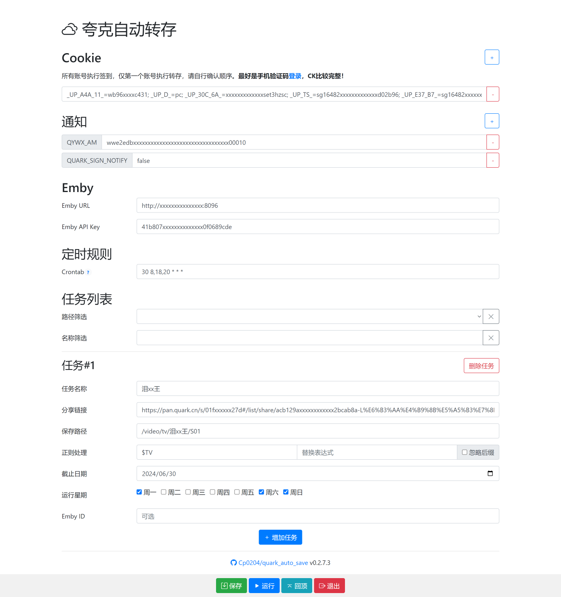

# 夸克网盘自动转存

对于一些持续更新的资源，隔段时间去转存十分麻烦。

定期执行本脚本自动转存、文件名整理，配合 Alist, rclone, Emby 可达到自动追更的效果。🥳



## 功能

- [x] 兼容青龙
- [x] 支持多组任务
- [x] 支持分享链接的子目录
- [x] 记录失效分享并跳过任务
- [x] 目标目录不存在时自动新建
- [x] 正则过滤要转存的文件名
- [x] 跳过已转存过的文件
- [x] 目标目录文件名整理，正则替换
- [x] 任务完成后推送通知
- [x] 任务结束期限，期限后不执行此任务
- [x] 追更或整理后自动刷新 Emby 媒体库
- [x] 可选忽略文件后缀
- [x] 支持 Docker 独立部署，WebUI 配置
- [x] 每日签到领空间
- [x] 支持多账号（多账号签到，仅首账号转存）

## 使用

### Docker 部署

提供 WebUI 管理配置，但目前 WebUI 并不完善，只供辅助使用，你也应该了解如何[手动配置](#程序配置)。

```shell
docker run -d \
  --name quark-auto-save \
  -p 5005:5005 \
  -v /yourpath/quark-auto-save/config:/app/config \
  --network bridge \
  --restart unless-stopped \
  ghcr.io/cp0204/quark-auto-save:latest
```

默认管理账号： `admin` ，密码 `admin123`，仅支持在 `quark_config.json` 中修改。

#### WebUI 预览



### 青龙部署

1. 拉库命令：

    ```
    ql repo https://github.com/Cp0204/quark-auto-save.git "quark" "" "sendNotify"
    ```

2. 首次运行程序将从本仓库下载配置模版。

3. 脚本管理中，手动编辑 `quark_config.json` 配置文件。

> 当配置中没有 cookie 字段时，则从青龙环境变量 `QUARK_COOKIE` 中读取，多账号用换行分隔。

### 程序配置

首次运行脚本将从本仓库下载 `quark_config.json` 配置模版：

```json
{
  "cookie": [
    "Your pan.quark.cn Cookie1, Only this one will do save task.",
    "Your pan.quark.cn Cookie2, Only sign after this."
  ],
  "push_config": {
    "QUARK_SIGN_NOTIFY": true, // 是否发送签到成功通知，也可在环境变量中设置
    "QYWX_AM": "",
    "其他推送渠道//此项可删": "配置方法同青龙"
  },
  "emby": {
    "url": "http://yourdomain.com:8096",
    "apikey": "" // 在后台 高级-API秘钥 中生成
  },
  "tasklist": [
    {
      "taskname": "鸣xx年",
      "shareurl": "https://pan.quark.cn/s/39xxxx35#/list/share/17xxxx72-鸣xx年",
      "savepath": "/video/tv/鸣xx年/S01",
      "pattern": "^广告内容(\\d+).(mp4|mkv)",
      "replace": "\\1.\\2",
      "enddate": "2024-01-30",  //可选
      "emby_id": "",            //可选
      "ignore_extension": true, //可选
      // 以下字段无需手动配置
      "savepath_fid": "0833xxxx712d7", // 程序运行获得的保存目录id
      "shareurl_ban": "分享地址已失效" // 记录分享是否失效；更新链接后请手动删去，如有此字段将跳过任务
    }
  ]
}
```

### 正则整理示例

| pattern | replace | 效果 |
| ------- |---------|------|
| `.*` |  | 无脑转存所有文件，不整理 |
| `\\.mp4$` |  | 转存所有 `.mp4` 后缀的文件 |
| `^【电影TT】形似走肉(\\d+).(mp4\|mkv)` | `\\1.\\2` | 【电影TT】形似走肉01.mp4 → 01.mp4<br>【电影TT】形似走肉02.mkv → 02.mkv |
| `^(\\d+).mp4` | `S02E\\1.mp4` | 01.mp4 → S02E01.mp4<br>02.mp4 → S02E02.mp4 |
| `$TV` |  | [魔法匹配](#魔法匹配)剧集文件 |

#### 参考资料

- [正则表达式30分钟入门教程](https://deerchao.cn/tutorials/regex/regex.htm)

- 注意`\`和[字符转义](https://deerchao.cn/tutorials/regex/regex.htm#escape)：如`\d`写作`\\d`，匹配字符`.`写作`\\.`

  > 其实上表示例匹配字符`.`并不完全严谨，应写作`\\.`；但`.`又刚好匹配一个位置，我为了可读性偷了个懒，可以效仿但应了解原理。

- 替换的[后向引用](https://deerchao.cn/tutorials/regex/regex.htm#backreference)：有些语言写作`$1`，Python中写作`\1`，转义后为`\\1`

### 特殊场景使用技巧

#### 忽略后缀

- 当目录已存*01.mp4、02.mp4*，新的源又有*01.mkv、02.mkv、03.mkv*，只希望获得*03.mkv*更新时。

- 一个部剧同时追更两个源，看谁更新快🤪，但两个源的视频格式不一时。

#### 使用青龙通知设置

删去配置文件中的整个 `push_config` 数组。

#### 自动刷新媒体库

同时配置 `emby.url` `emby.apikey` 和任务的 `emby_id` ，将在新存或整理自动刷新 Emby 媒体库、刷新元数据。

#### 魔法匹配

当任务 `pattern` 值为 `$开头` 且 `replace` 留空时，实际将调用程序预设的正则表达式。

如 `$TV` 可适配和自动整理市面上90%分享剧集的文件名格式，具体实现见代码，欢迎贡献规则。

## 打赏

如果这个项目让你受益，你可以打赏我1块钱，让我知道开源有价值。谢谢！

