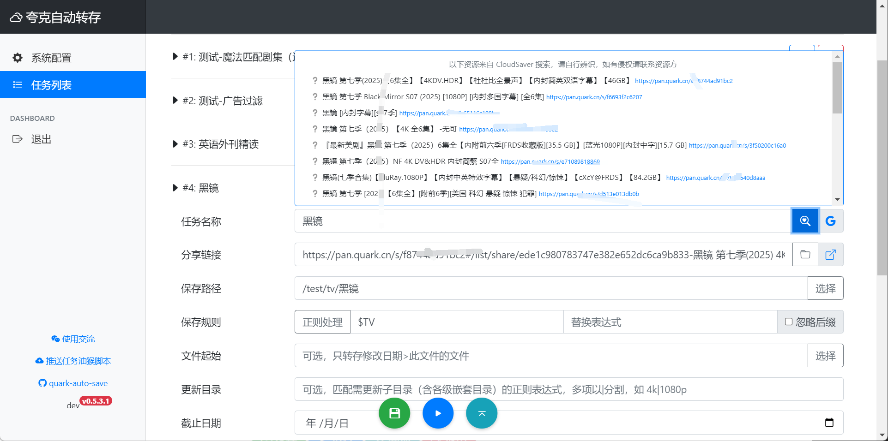
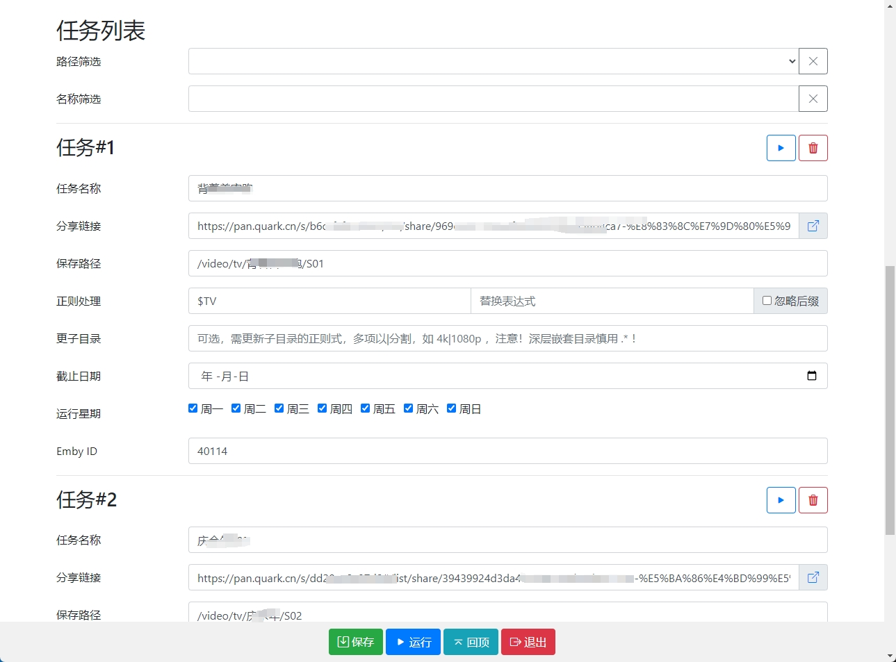

<div align="center">


# 夸克网盘自动转存

夸克网盘签到、自动转存、命名整理、发推送提醒和刷新媒体库一条龙。

对于一些持续更新的资源，隔段时间去转存十分麻烦。

定期执行本脚本自动转存、文件名整理，配合 Alist, rclone, Emby 可达到自动追更的效果。🥳


[![wiki][wiki-image]][wiki-url] [![github releases][gitHub-releases-image]][github-url] [![docker pulls][docker-pulls-image]][docker-url] [![docker image size][docker-image-size-image]][docker-url]

[wiki-image]: https://img.shields.io/badge/wiki-Documents-green?logo=github
[gitHub-releases-image]: https://img.shields.io/github/v/release/Cp0204/quark-auto-save?logo=github
[docker-pulls-image]: https://img.shields.io/docker/pulls/cp0204/quark-auto-save?logo=docker&&logoColor=white
[docker-image-size-image]: https://img.shields.io/docker/image-size/cp0204/quark-auto-save?logo=docker&&logoColor=white
[github-url]: https://github.com/Cp0204/quark-auto-save
[docker-url]: https://hub.docker.com/r/cp0204/quark-auto-save
[wiki-url]: https://github.com/Cp0204/quark-auto-save/wiki


</div>

> [!CAUTION]
> ⛔️⛔️⛔️ 注意！资源不会每时每刻更新，**严禁设定过高的定时运行频率！** 以免账号风控和给夸克服务器造成不必要的压力。雪山崩塌，每一片雪花都有责任！

> [!NOTE]
> 因不想当客服处理各种使用咨询，即日起 Issues 关闭，如果你发现了 bug 、有好的想法或功能建议，欢迎通过 PR 和我对话，谢谢！

## 功能

- 部署方式
  - [x] 兼容青龙
  - [x] 支持 Docker 独立部署，WebUI 配置

- 分享链接
  - [x] 支持分享链接的子目录
  - [x] 记录失效分享并跳过任务
  - [x] 支持需提取码的分享链接 <sup>[?](https://github.com/Cp0204/quark-auto-save/wiki/%E4%BD%BF%E7%94%A8%E6%8A%80%E5%B7%A7%E9%9B%86%E9%94%A6#%E6%94%AF%E6%8C%81%E9%9C%80%E6%8F%90%E5%8F%96%E7%A0%81%E7%9A%84%E5%88%86%E4%BA%AB%E9%93%BE%E6%8E%A5)</sup>

- 文件管理
  - [x] 目标目录不存在时自动新建
  - [x] 跳过已转存过的文件
  - [x] 正则过滤要转存的文件名
  - [x] 转存后文件名整理（正则替换）
  - [x] 可选忽略文件后缀

- 任务管理
  - [x] 支持多组任务
  - [x] 任务结束期限，期限后不执行此任务
  - [x] 可单独指定子任务星期几执行

- 媒体库整合
  - [x] 根据任务名搜索 Emby 媒体库
  - [x] 追更或整理后自动刷新 Emby 媒体库
  - [x] **媒体库模块化，用户可很方便地[开发自己的媒体库hook模块](./media_servers)**

- 其它
  - [x] 每日签到领空间 <sup>[?](https://github.com/Cp0204/quark-auto-save/wiki/%E4%BD%BF%E7%94%A8%E6%8A%80%E5%B7%A7%E9%9B%86%E9%94%A6#%E6%AF%8F%E6%97%A5%E7%AD%BE%E5%88%B0%E9%A2%86%E7%A9%BA%E9%97%B4)</sup>
  - [x] 支持多个通知推送渠道 <sup>[?](https://github.com/Cp0204/quark-auto-save/wiki/%E9%80%9A%E7%9F%A5%E6%8E%A8%E9%80%81%E6%9C%8D%E5%8A%A1%E9%85%8D%E7%BD%AE)</sup>
  - [x] 支持多账号（多账号签到，仅首账号转存）

## 使用

### Docker 部署

Docker 部署提供 WebUI 管理配置，图形化配置已能满足绝大多数需求。部署命令：

```shell
docker run -d \
  --name quark-auto-save \
  -p 5005:5005 \
  -e WEBUI_USERNAME=admin \
  -e WEBUI_PASSWORD=admin123 \
  -v ./quark-auto-save/config:/app/config \
  -v /etc/localtime:/etc/localtime \
  --network bridge \
  --restart unless-stopped \
  cp0204/quark-auto-save:latest
```

docker-compose.yml

```yaml
name: quark-auto-save
services:
  quark-auto-save:
    image: cp0204/quark-auto-save:latest
    # image: registry.cn-shenzhen.aliyuncs.com/cp0204/quark-auto-save:latest
    container_name: quark-auto-save
    network_mode: bridge
    ports:
      - 5005:5005
    restart: unless-stopped
    environment:
      WEBUI_USERNAME: "admin"
      WEBUI_PASSWORD: "admin123"
    volumes:
      - ./quark-auto-save/config:/app/config
      - /etc/localtime:/etc/localtime
```

管理地址：http://yourhost:5005

| 环境变量         | 默认       | 备注     |
| ---------------- | ---------- | -------- |
| `WEBUI_USERNAME` | `admin`    | 管理账号 |
| `WEBUI_PASSWORD` | `admin123` | 管理密码 |

#### 一键更新

```shell
docker run --rm -v /var/run/docker.sock:/var/run/docker.sock containrrr/watchtower -cR quark-auto-save
```

<details open>
<summary>WebUI 预览</summary>





</details>

### 青龙部署

程序也支持以青龙定时任务的方式运行，但该方式无法使用 WebUI 管理任务，需手动修改配置文件。

青龙部署说明已转移到 Wiki ：[青龙部署教程](https://github.com/Cp0204/quark-auto-save/wiki/%E9%83%A8%E7%BD%B2%E6%95%99%E7%A8%8B#%E9%9D%92%E9%BE%99%E9%83%A8%E7%BD%B2)

### 正则整理示例

| pattern                                | replace      | 效果                                                                   |
| -------------------------------------- | ------------ | ---------------------------------------------------------------------- |
| `.*`                                   |              | 无脑转存所有文件，不整理                                               |
| `\.mp4$`                               |              | 转存所有 `.mp4` 后缀的文件                                             |
| `^【电影TT】形似走肉(\d+)\.(mp4\|mkv)` | `\1.\2`      | 【电影TT】形似走肉01.mp4 → 01.mp4<br>【电影TT】形似走肉02.mkv → 02.mkv |
| `^(\d+)\.mp4`                          | `S02E\1.mp4` | 01.mp4 → S02E01.mp4<br>02.mp4 → S02E02.mp4                             |
| `$TV`                                  |              | [魔法匹配](#魔法匹配)剧集文件                                          |
| `^(\d+)\.mp4`                          | `$TASKNAME.S02E\1.mp4` | 01.mp4 → 任务名.S02E01.mp4                                             |

更多正则使用说明已转移到 Wiki ：[正则处理教程](https://github.com/Cp0204/quark-auto-save/wiki/%E6%AD%A3%E5%88%99%E5%A4%84%E7%90%86%E6%95%99%E7%A8%8B)

### 特殊场景使用技巧

#### 忽略后缀

- 当目录已存*01.mp4、02.mp4*，新的源又有*01.mkv、02.mkv、03.mkv*，只希望获得*03.mkv*更新时。

- 一个部剧同时追更两个源，看谁更新快🤪，但两个源的视频格式不一时。

#### 自动刷新媒体库

同时配置 `emby.url` `emby.apikey` 和任务的 `emby_id` ，将在新存或整理后自动刷新 Emby 媒体库、刷新元数据。

#### 魔法匹配

当任务 `pattern` 值为 `$开头` 且 `replace` 留空时，实际将调用程序预设的正则表达式。

如 `$TV` 可适配和自动整理市面上90%分享剧集的文件名格式，具体实现见代码，欢迎贡献规则。

## 打赏

如果这个项目让你受益，你可以打赏我1块钱，让我知道开源有价值。谢谢！

*由于微信限制，无法反向联系付款人，感谢您的支持！* 😉


## 声明

本程序为个人兴趣开发，开源仅供学习与交流使用。

程序没有任何破解行为，只是对于夸克已有的API进行封装，所有数据来自于夸克官方API，本人不对网盘内容负责、不对夸克官方API未来可能的改动导致的后果负责。